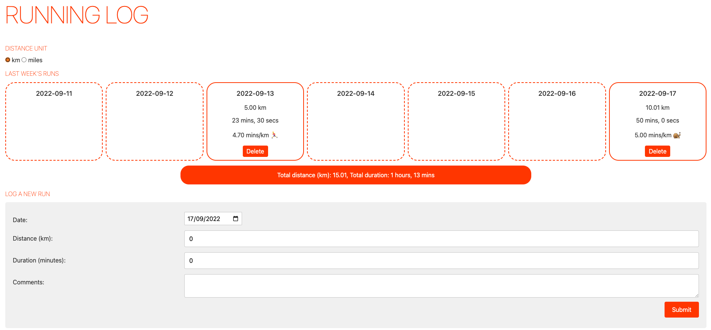
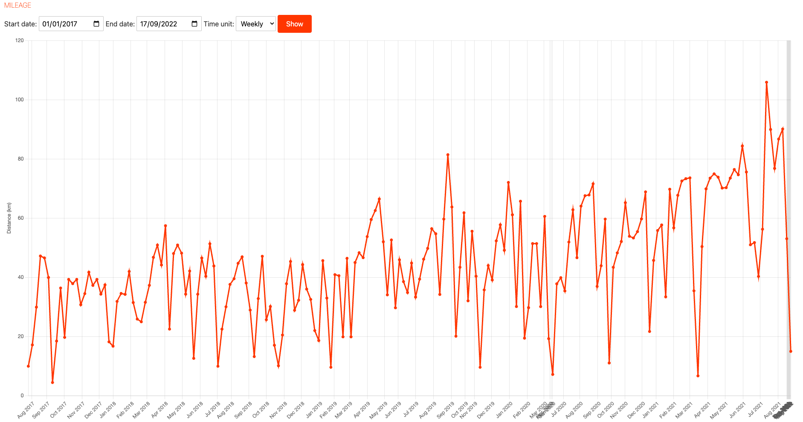

# Running log

This is a simple app with a FastAPI backend and Svelte frontend that allows you to log runs.

To run the app you'll need to open two terminals:

1. Frontend

```
cd frontend
npm run dev
```

The app should now be visible at `localhost:5000`, although for it to work correctly you'll need to set up the backend as well.

2. Backend

```
cd backend
python -m venv .venv
source .venv/bin/activate
python -m pip install -r requirements.txt
python app/api.py
```

## Examples

The log of last week's runs:



Mileage chart for the full history of the running log:


